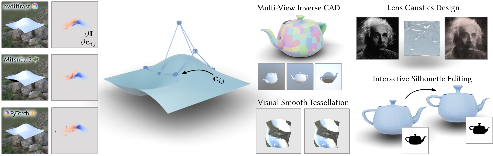

<p align="center">

  <h1 align="center"><a>Differentiable Rendering of Parametric Geometry</a></h1>

  <div  align="center">
    <a href="https://mworchel.github.io/differentiable-shadow-mapping">
      
    </a>
  </div>

  <p align="center">
    <i>ACM Transactions on Graphics (SIGGRAPH Asia 2023)</i>
    <br />
    <a href="https://github.com/mworchel"><strong>Markus Worchel</strong></a>
    ·
    <a href="https://www.cg.tu-berlin.de/team/prof-dr-marc-alexa/"><strong>Marc Alexa</strong></a>
  </p>
</p>

## About

This repository contains the official implementation of the paper "Differentiable Rendering of Parametric Geometry", which proposes techniques for robust differentiable rendering of parametric spline geometry. The implementation is based on PyTorch and is provided as installable package `drpg`. The following modules may be of primary interest to most users:
* `bezier_curve.py`, `bezier_surface.py`, `casteljau.py`: routines for differentiable Bézier curve/surface evaluation and subdivision
* `tessellation.py`: routines for uniform and adaptive differentiable tessellation
* `regularization.py`: routines for regularization (C1/G1 losses) and gradient preconditioning


## Getting Started 

Setup the environment and install the required packages using conda

```bash
conda env create -f environment.yml
conda activate drpg
```

Install our package by running the following command in the repository directory

```bash
pip install .
```

Now you can explore and run the notebooks and scripts provided in this repository.

### General Framework

The data structures and tessellation routines are briefly introduced in the notebooks

* `1_data_structures.ipynb`
* `2_tessellation.ipynb`

### Multi-View Reconstruction

Multi-view reconstruction experiments can be run using the script

* `3_multiview_reconstruction.py`

On a high level, the script accepts a mesh that is used to generate the (artificial) multi-view inputs. It then performs the 3D reconstruction. Please keep in mind that the script is not designed to load actual real world image data. The reconstruction for the bottom left object in Figure 19 can be reproduced by running

```bash
python 3_multiview_reconstruction.py configs/abc_1.json --viewer
```

The flag `--viewer` will launch an interactive 3D viewer that shows the optimization in real time. After the optimization has finished, you will need to close the viewer window manually. The results are located in `out/multiview/abc_1`, including a tessellation of the reconstructed spline surface (`optimized.obj`) and its control mesh (`control_mesh.npz`). 

The reconstruction of Spot in Figure 21 can be reproduced by running

```bash
python 3_multiview_reconstruction.py configs/spot.json --viewer
```


### Caustics Lens Design

The experiments for lens design with caustics images can be run using the script

* `4_caustics_design.py`

The script accepts a target caustics image and will optimize a lens, represented by a NURBS surface, such that the lens will reproduce the target caustics under illumination. The results for the bear cub in Figure 22 (last row, middle) can be reproduced by running

```bash
python 4_caustics_design.py data/bear.png out/caustics/bear --viewer
```

The results will be located in `out/caustics/bear` and include a rendering of the final caustics image (`rendering.png`), the control points of the NURBS surface (`control_points.npy`), and a tessellated version of the lens (`optimized.obj` + `slab.ply`)

### Silhouette Reconstruction with Curves

Reconstruction of parametric curves from silhouette images is shown in the notebook

* `5_silhouette_curve.ipynb`

## License and Copyright

The code in this repository is provided under a 3-clause BSD license. 

The following functions/classes are based on the code for [Large Steps in Inverse Rendering of Geometry](https://github.com/rgl-epfl/large-steps-pytorch) (3-clause BSD): `drpg.regularization.compute_lsig_matrix`, `drpg.regularization.laplacian_uniform_all`, and `drpg.rendering.SphericalHarmonics`. 

The black and white [bear cub painting](data/bear.png) has been created for this publication and is released to the public domain (CC0). The copyright of the ABC objects is owned by their creators, see the [ABC dataset](https://deep-geometry.github.io/abc-dataset/) for details.
[Spot](https://www.cs.cmu.edu/~kmcrane/Projects/ModelRepository/) by Keenan Crane (CC0). [Kloppenheim 06 HDRI](https://polyhaven.com/a/kloppenheim_06) by polyhaven (CC0).

## Citation

If you find this code or our method useful for your academic research, please cite our paper

```bibtex
@article{worchel:2023:drpg,
  author = {Worchel, Markus and Alexa, Marc},
  title = {Differentiable Rendering of Parametric Geometry},
  journal = {ACM Trans. Graph.},
  year = {2023},
  month = {dec},
  volume = {42},
  number = {6},
  url = {https://doi.org/10.1145/3618387},
  doi = {10.1145/3618387},
}
```